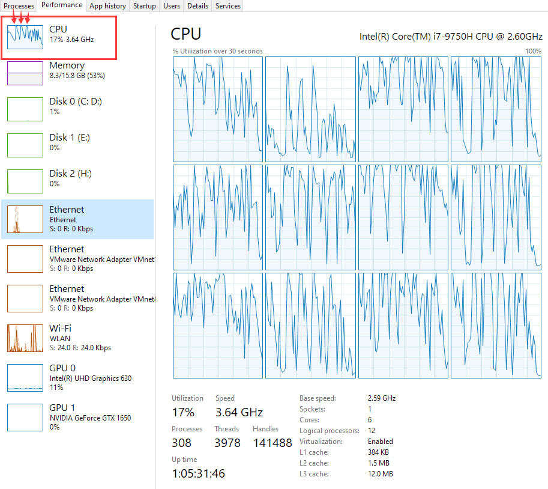
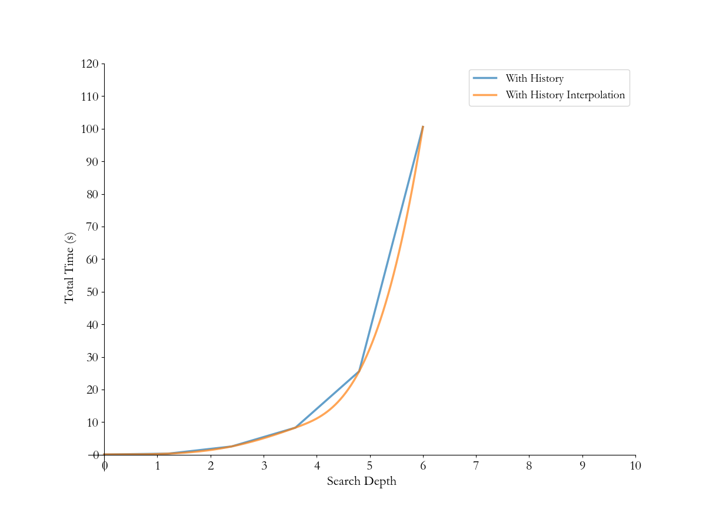
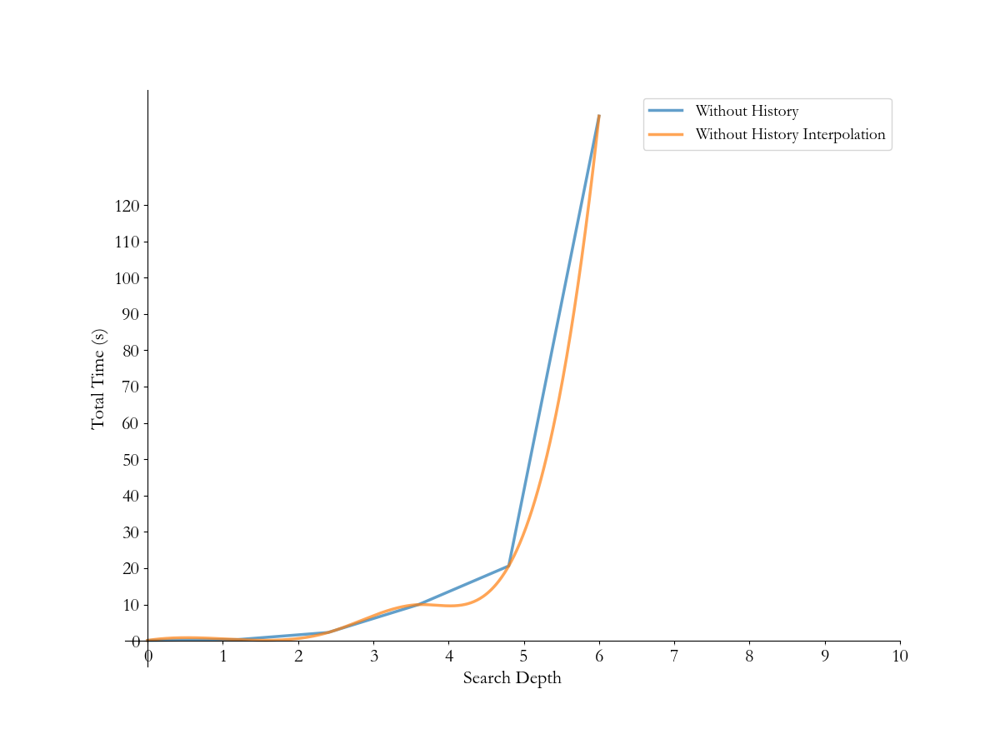
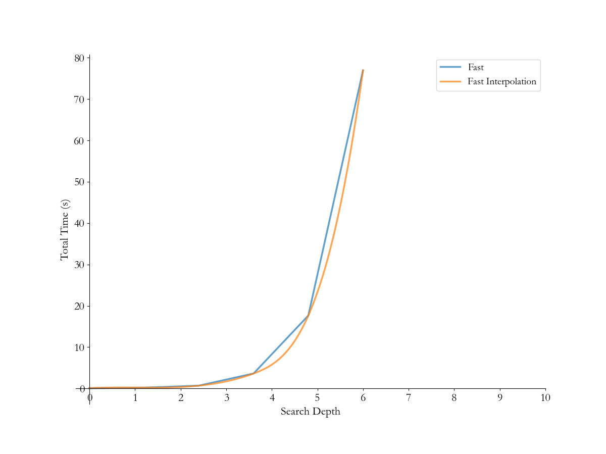
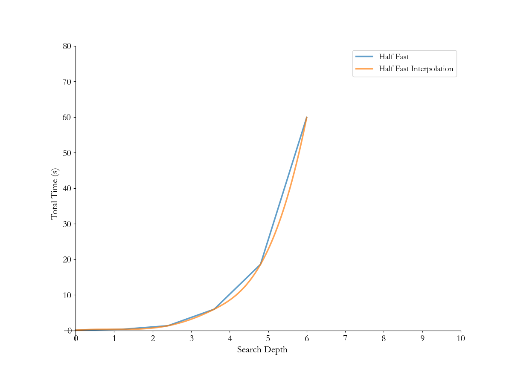
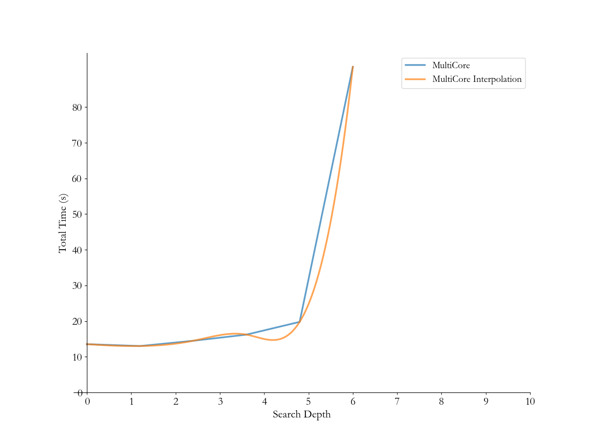
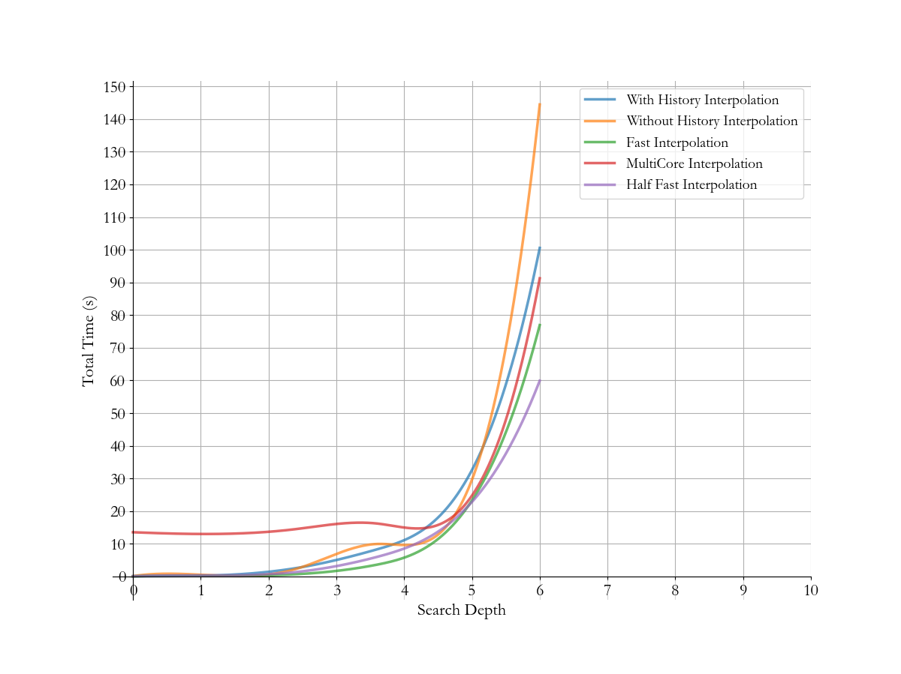
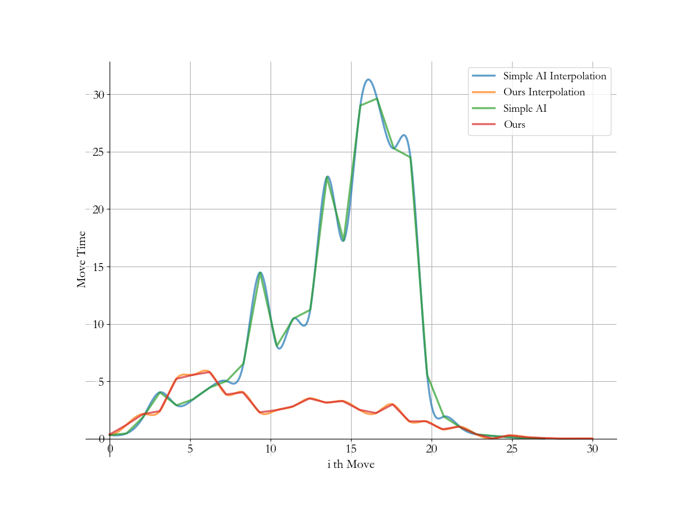
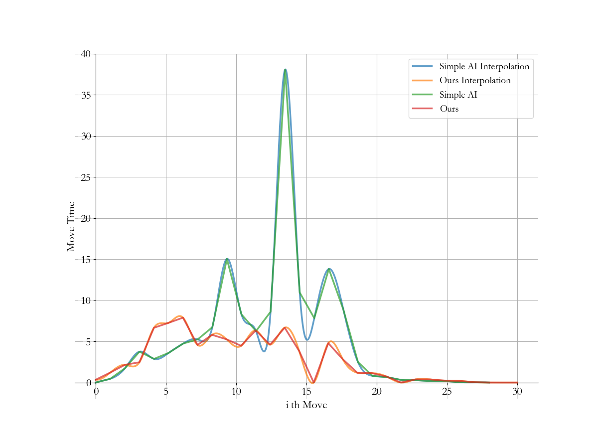

# miniAlphaGo程序报告

[toc]

## 1. 个人基本信息

- 学生姓名：徐震
- 学号：3180105504
- 课程：《人工智能》2020春夏学期
- 教师姓名：吴飞
- 项目名称：miniAlphaGo for Reversi

## 2. 项目基本信息

### 2.1 实验基本要求

- 使用 **『最小最大搜索』**、**『Alpha-Beta 剪枝搜索』** 或 **『蒙特卡洛树搜索算法』** 实现 miniAlphaGo for Reversi（三种算法择一即可）。
- 使用 Python 语言。
- 算法部分需要自己实现，不要使用现成的包、工具或者接口。
- 提交程序报告,请在本地编辑并命名为**『程序报告.docx』**后，上传到左侧文件列表中。

### 2.2 实现与测试环境

- Python 3.7.4 (default, Aug  9 2019, 18:34:13) [MSC v.1915 64 bit (AMD64)] :: Anaconda, Inc. on win32
- Intel(R) Core(TM) i7-9759H CPU @ 2.60GHz  2.59 GHz
- Installed Memory: 16.0 GB (15.9 GB usable)
- Microsoft Windows [Version 10.0.18363.720]

### 2.3 使用/修改/添加API

已有的`board.py`，`game.py`以及`human_player`，`random_player`实现：

- 略，已经在课程作业中被详细介绍

AIPlayer用到的API：

- `board.py`
  - `get_legal_actions`
  - `_move`
  - `backpropagation`
  - `board_num`

测试过程中修改/添加的API：

- `game.py`

  - `run`：修改的是计时器，原程序使用`now`进行计时，不准确，甚至出现负数，我们测试中使用了`time.pref_counter`，来进行更高精度的性能测试

    ```python
    ...
    start_time = time.perf_counter()
    ...
    end_time = time.perf_counter()
    ...
    ```

    测试过程中遇到单子超过60s的性能测试需求，因此修改了`func_timeout`参数以进行测试

    ```python
    action = func_timeout(6000, self.current_player.get_move, kwargs={'board': self.board})
    # 第一个参数的单位是秒
    ```

  - `run_quite`：是我们为了方便大批量测试添加的API，只打印有用的log，有利于一目了然的观察性能信息，相对于原本的`run`，修改的地方莫过于注释掉`board.display`等语句

  - 调整`init`以增加复盘功能（与`board.py`）中调整对应

    ```python
    def __init__(self, black_player, white_player, init_board=None):
        self.board = Board(init_board)  # Changed here
        self.current_player = None
        self.black_player = black_player
        self.white_player = white_player
        self.black_player.color = "X"
        self.white_player.color = "O"
    ```

- `main.py`

  - 仿照`main.ipynb`中的最后一个代码块进行修改，方便本地测试，调试与性能验证
  - 有两种可能的使用模式：
    - 循环模式：每次游戏结束后给用户修改最大深度等超参数的机会，并按用户意愿继续进行或停止比赛
    - 测试模式：按照一定深度进行测试，调用`run_quite`API来保留重要的log信息
  
- `board.py`

  - 调整`init`函数以增加复盘功能（方便人类玩家）

    ```python
    def __init__(self, init_board=None):
        self.empty = '.'
        if init_board is not None:
            self._board = init_board
        else:
            self._board = [[self.empty for _ in range(8)] for _ in range(8)]
            self._board[3][4] = 'X'
            self._board[4][3] = 'X'
            self._board[3][3], self._board[4][4] = 'O', 'O'
    ```
  
- 测试举例

  ```python
  if __name__ == '__main__':
      from game import Game
      from HumanPlayer import HumanPlayer
      from RandomPlayer import RandomPlayer
      import MultiCore
      import SingleCore
      import really_simple
  
      while True:
          black_player = RandomPlayer("X")
          white_player = MultiCore.AIPlayer("O", max_depth=6)
          # init_board = None
          init_board = [
              ['.', '.', 'X', 'X', 'X', 'X', '.', '.'],
              ['.', '.', 'X', 'X', 'X', 'X', '.', '.'],
              ['X', 'X', 'X', 'X', 'X', 'X', 'X', 'X'],
              ['X', 'X', 'X', 'X', 'X', 'X', 'X', 'X'],
              ['X', 'X', 'X', 'O', 'X', 'X', 'X', 'X'],
              ['X', 'X', 'X', '.', 'X', 'X', 'X', 'X'],
              ['.', '.', '.', 'O', 'O', 'O', '.', '.'],
              ['.', '.', '.', '.', '.', 'O', '.', '.'],
          ]
          game = Game(black_player, white_player, init_board)
          game.run()
          again = input("再试一次？：yes/no: ")
          if again[0] == 'N' or again[0] == 'n':
              break
  ```

  


## 3. 项目原理

项目实现过程中用到了：

1. Min-Max游戏树搜索
2. Alpha-Beta剪枝搜索，递归式的函数重用
3. History-Table历史表辅助搜索
4. 基于棋盘权重，行动力，稳定子等的评估函数
5. 与游戏进度相关的动态评估能力
7. `numpy`提供的向量化高速运算
7. `multiprocessing`提供的多核辅助搜索

注意到在项目中我们实现了单核，多核两种不同的搜索加速方式，两者的主要区别在于历史表，下面的原理解析中主要以单核版本为依据，最后说明多核版本的实现方式

### 3.1 核心思想：Min-Max游戏树搜索

我们采用了Min-Max搜索而不是蒙特卡洛树搜索作为主要实现方式的原因如下：

1. Min-Max相对容易实现与拓展，有更大的优化空间
2. 本次项目没有用到GPU训练蒙特卡洛树搜索需要的各类评估网络，评估效果不一定足够优秀
3. 阅读相关论文后发现普通游戏树搜索往往比那些没有经过精心调教的采样式搜索效果好
4. 蒙特卡洛树搜索涉及到一些复杂的数学运算，难以利用`numpy`提供的向量化加速优势
5. 蒙特卡洛树搜索过程中需要随时对各种信息进行更新，无法保证线程安全性，很难做到多核CPU优化

Min-Max的原理与书中描述的基本相同，只不过我们采用了递归的形式来简化实现难度，下面粘贴伪代码

```python
if terminal_state:
    return self.evaluate(board), action
# If no terminal state is encountered, we should just enumerate on possible moves computed above
for move in moves:
    flipped = board._move(move, color)  # Make a move
    val = -self.alpha_beta(board, -beta, -alpha, oppo_color, depth - 1)[0]  # Recursively compute the reward
    board.backpropagation(move, flipped, color)  # Reverse the change made to gaming board for the next enumeration
    # Update current maximum reward value
    if val > max_val:
        max_val = val
        action = move
return max_val, action
```

### 3.2 Alpha-Beta剪枝搜索，递归式的函数调用

我们使用了Alpha-Beta剪枝搜索以加快搜索速度，减少不必要的查找搜索开销

采用了普通的Alpha-Beta剪枝的搜索树策略的时间复杂度为$O(\sqrt{w}^d)$也就是$O({w}^{\frac{d}{2}})$

可以明显加快搜索过程，根据一些分析，若是我们对查找的内容简单排序，就可以逼近上述时间复杂度（也就是我们下面用到的History-Table）

注意我们使用了递归，并且将Max Node与Min Node合并到一起，若要将Min-Max Node的代码合并，我们需要进行以下工作：

1. 将每次调用`alpha_beta`函数的返回值调转符号作为其父节点的值
2. 每次调用`alpha_beta`函数时调换alpha与beta的值，并且调整他们的符号
3. 每次实现剪枝的时候都将本节点当作Max节点来看，即为：
   1. 当取得的`max_val`比我们已有的alpha值大的时候，更新alpha值
   2. 当取得的`max_val`比我们已有的beta值大的时候，进行剪枝

```python
if terminal_state:
    return self.evaluate(board), action
# If no terminal state is encountered, we should just enumerate on possible moves computed above
for move in moves:
    flipped = board._move(move, color)  # Make a move
    val = -self.alpha_beta(board, -beta, -alpha, oppo_color, depth - 1)[0]  # Recursively compute the reward
    board.backpropagation(move, flipped, color)  # Reverse the change made to gaming board for the next enumeration
    # Update current maximum reward value
    if val > max_val:
        max_val = val
        action = move
        # Update current alpha value for alpha-beta pruning
        if max_val > alpha:
            if max_val >= beta:
                action = move
                return max_val, action
            # Update
            alpha = max_val
return max_val, action
```

### 3.3 History-Table历史表辅助搜索

我们通过历史表来提高`alpha-beta`剪枝搜索的效率

虽然这样做的具体数学原理还有待进一步探究，但多次实验发现添加历史表造成的性能下降小于它带来的性能提升

历史表就是一个2\*64\*64的表格，记录某种颜色的子在某一步的某个棋局的排序

```python
self.history = np.tile(np.arange(64), 128).reshape((2, 64, 64))
```

我们定义了这样的一些函数来配合历史表工作

- 根据历史表来对当前走法进行排序的`history_sort`

```python
def history_sort(self, board, moves, color, depth):
    """
    Sort possible moves by their previous performance
    :param board: Current state of gaming
    :param moves: The moves involved
    :param color: Current color
    :param depth: How many steps since the beginning of the game
    :return: sorted moves based on history table (previous performance of every move)
    """
    if depth >= 64:
        return moves
    # get all possible positions for the moves argument we've accepted
    poss = list(map(lambda x: x[0] * 8 + x[1], [board.board_num(move) for move in moves]))
    # numpy grants argument indexing with np.array
    values = self.history[int(color == self.color), depth][poss]
    # perform argsort based on the values we've got
    idx = np.argsort(values)
    # Return the moves in a sorted order
    return np.asarray(moves)[idx]
```

- 当某种走法带来剪枝或者不是最差的走法的时候，提高这种走法下次被读取的优先级
  - 如果带来了剪枝，则放到最优的位置
  - 如果没有带来剪枝，但不是最差的走法，则向前移动一个格

```python
def reward_move(self, board, move, color, depth, best):
    """
    Reward a move by raising its ranking if it leads to pruning or is not the worst move
    :param board: Current state of gaming
    :param move: The move to be rewarded
    :param color: Current color
    :param depth: How many steps since the beginning of the game
    :param best: Whether the move to be rewarded is a best move (leads to pruning)
    :return: nothing
    """
    if depth >= 64:
        return
    # Compute the corresponding position of the move to be rewarded
    x, y = board.board_num(move)
    pos = x * 8 + y
    color = int(color == self.color)

    # Get value
    val = self.history[color, depth, pos]
    other_pos = np.argwhere(self.history[color, depth, :] == val - (val if best else (1 if val else 0)))

    # Exchange position
    self.history[color, depth, other_pos], self.history[color, depth, pos] = self.history[color, depth, pos], self.history[color, depth, other_pos]
```

完整的`alpha_beta`函数调用了上面定义的这两个方法

```python
...
...
    moves = self.history_sort(board, moves, color, global_depth)  # History sort
    for move in moves:
        flipped = board._move(move, color)
        val = -(self.alpha_beta(board, -beta, -alpha, oppo_color, depth - 1, step)[0])
        board.backpropagation(move, flipped, color)
        if val > max_val:
            max_val = val
            action = move
            if max_val > alpha:
                if max_val >= beta:
                    self.reward_move(board, action, color, global_depth, True)  # Reward move for best
                    return max_val, action
                alpha = max_val
    if action is not None:
        self.reward_move(board, action, color, global_depth, False)  # Reward move
    return max_val, action
```

### 3.4 考虑多重因素的评估函数

我们对Terminal State（或者Max Depth State）的评估函数进行了多方面的调优和测试。在查询资料过程中，我们了解到多种评估策略

1. 棋盘权重：

   类似于围棋，黑白棋也有金角银边草肚皮的简单规律。

   我们更倾向于让走子偏向于角点。

   我们在实验过程中采用过的一些权重有

   |       |   A   |   B   |   C   |   D   | E   |   F   |   G   |   H   |
   | :---: | :---: | :---: | :---: | :---: | --- | :---: | :---: | :---: |
   |   1   |  150  |  -80  |  10   |  10   | 10  |  10   |  -80  |  150  |
   |   2   |  -80  |  -90  |   5   |   5   | 5   |   5   |  -90  |  -80  |
   |   3   |  10   |   5   |   1   |   1   | 1   |   1   |   5   |  10   |
   |   4   |  10   |   5   |   1   |   1   | 1   |   1   |   5   |  10   |
   |   5   |  10   |   5   |   1   |   1   | 1   |   1   |   5   |  10   |
   |   6   |  10   |   5   |   1   |   1   | 1   |   1   |   5   |  10   |
   |   7   |  -80  |  -90  |   5   |   5   | 5   |   5   |  -90  |  -80  |
   |   8   |  150  |  -80  |  10   |  10   | 10  |  10   |  -80  |  150  |

2. 行动力

   我们定义行动力为

   (本方的可能下法数量-对方的可能下法数量)*参数

   ```python
   mobility = (len(moves) - len(oppo_moves)) * self.factor
   ```

   其中`self.factor`是一个实现定义好的超参数

   实际测试发现，越高的行动力权重会导致越高的短视性


3. 稳定子策略

   稳定子的定义是：无法被对方翻转的棋子的个数

   为了方便实际测试，我们仅仅对边上的稳定子进行计算

   当角落有子，本边的子数量可以粗略表示稳定子的值

   **值得注意的是，计算稳定子会导致程序运行效率大幅度下降（当然，是复杂度常数而非复杂度本身）**

   因此在实际使用中我们很少计算稳定子

   相关的实现代码如下
   
   ```python
   # Get current board from the gaming board by a 3-value representation form
   _board = np.asarray([[1 if (piece is color) else (-1 if piece is oppo_color else 0)
                         for piece in line] for line in board._board])
   # Separately arranging the board by segmentation
   sep_board = np.stack(((_board == 1).astype(int), np.negative((_board == -1).astype(int))))
   # Use vectorized method to compute stability
   stability = 0
   for i in range(2):
       if sep_board[i, 0, 0]:
           stability += np.sum(sep_board[i, 0, 0:-1]) + np.sum(sep_board[i, 1::, 0])
           if sep_board[i, 1, 1]:
               stability += np.sum(sep_board[i, 1, 1:-2]) + np.sum(sep_board[i, 2:-1, 1])
       if sep_board[i, 0, -1]:
           stability += np.sum(sep_board[i, 0:-1, -1]) + np.sum(sep_board[i, 0, 0:-1])
           if sep_board[i, 1, -2]:
               stability += np.sum(sep_board[i, 1:-2, -2]) + np.sum(sep_board[i, 1, 1:-2])
       if sep_board[i, -1, -1]:
           stability += np.sum(sep_board[i, -1, 1::]) + np.sum(sep_board[i, 0:-1, -1])
           if sep_board[i, -2, -2]:
               stability += np.sum(sep_board[i, -2, 2:-1]) + np.sum(sep_board[i, 1:-2, -2])
       if sep_board[i, -1, 0]:
           stability += np.sum(sep_board[i, 1::, 0]) + np.sum(sep_board[i, -1, 1::])
           if sep_board[i, -2, 1]:
               stability += np.sum(sep_board[i, 2:-1, 1]) + np.sum(sep_board[i, -2, 2:-1])
   ```
   
4. 激进的占角策略

   为了减少不必要的计算以及保证占角能力
   
   我们会直接在`get_move`方法得到调用的时候检测是否可以走角，并采取激进的占角策略：
   
   - 若发现角则直接走角
   
   ```python
   moves = list(board.get_legal_actions(self.color))
   for good in self.goods:
       if good in moves:
           return good
   # self.goods is defined as:
   self.goods = ["A1", "A8", "H1", "H8"]
   ```
   
5. 激进的躲避坏点策略

   在`evaluate`函数中我们会直接检测本步骤是否踏入了坏点

   虽然这种方式在实际的AI中没有使用

   - 若已经踏入坏点，则直接返回一个很小的reward值（当然，坏点周围的角必须没有被我们占领才算做坏点）
   
   ```python
   n = np.asarray([[1 if (piece is color) else (-1 if piece is oppo_color else 0) for piece in line] for line in board._board])
   if n[0][0] is not 1 and (n[0][1] or n[1][0] or n[1][1]):
       return self.small_val
   if n[7][0] is not 1 and (n[7][1] or n[6][0] or n[6][1]):
       return self.small_val
   if n[0][7] is not 1 and (n[0][6] or n[1][7] or n[1][6]):
       return self.small_val
   if n[7][7] is not 1 and (n[7][6] or n[6][7] or n[6][6]):
    return self.small_val
   ```

   我们还在`alpha_beta`中增加了坏点剔除函数

   通过在一定范围内剔除游戏中的坏点来增加我们AI不走坏点的几率（这其实也是与进度相关的动态评估能力的一种）
   
   ```python
   def remove_bad(self, moves):
       temp_moves = moves
       for bad in self.bads:
           try:
               temp_moves.remove(bad)
           except ValueError:
               pass
       if len(temp_moves) != 0:
           return temp_moves
       else:
           return moves
   ```
   
6. 最大宽度限制

   这种策略在实际使用中没有用到

   因为我们的算力可以支持深度为7的搜索，而深度为8的搜索一定会导致超时

   及时在这里进行调整也没有太大的作用

   反而会失去一些选择

   ```python
   # NOT USED: limit the maximum width to expand on
   moves = moves[::min(len(moves), self.max_width)]
   ```

### 3.5 与游戏进度相关的动态评估能力

1. 消失子策略

   在游戏前期，保持行动力甚至比一味的追求子的数量更有用

   我们在游戏的`alpha-beta`的函数中添加了这样的代码，经过实际测试，这样做有用

   ```python
   if depth <= 0:  # Terminate state reached
       mobility = (len(moves) - len(oppo_moves)) * self.factor  # get rid of unnecessary computation
       if global_depth < 16:
           return mobility, action # use mobility as reward value(which might be small)
       return self.evaluate(board, color, oppo_color) + mobility, action
   ```
   
2. 根据游戏进度选择是否要删除坏点

   在搜索的第一步，如果我们还有其他的选择，就不走坏点

   只选择第一步的原因是我们只需要保证实际选择的走法中少走坏点即可

   52步以后不选择的原因是防止陷入死循环

   ```python
   if depth == self.depth and global_depth <= 52:
       moves = self.remove_bad(moves)
   ```

3. 根据游戏进度调整深度

   这种策略在实际使用中没有用到

   因为我们的算力可以支持深度为7的搜索

   在实际应用中很难找到控制搜索深度而又不超时的方法


### 3.6 `numpy`提供的向量化高速运算

注意到我们在程序中使用了`numpy`来支持高速的向量运算

`numpy`会将大量数据以比较整齐的方式导入内存中，并且调用C语言实现的函数来加快运行

>- Numpy array is a collection of similar data-types which are densely packed in memory. A Python list can have different data-types, which puts lots of extra constraints while doing computation on it.
>- Numpy is able to divide a task into multiple subtasks and process them parallelly.
>- Numpy functions are implemented in C. Which again makes it faster compared to Python Lists.

因此在处理大型数据计算的时候，我们可以通过利用`numpy`这样的特性来大幅度提高性能——向量化

例如，在调用次数最多的`evaluate`函数中，我们使用`numpy`来进行当前棋局与权重矩阵的数值乘法

```python
def evaluate(self, board, color, oppo_color):
    _board = np.asarray([[1 if (piece is color) else (-1 if piece is oppo_color else 0)
                          for piece in line] for line in board._board])
	...
    ...
    _board *= self.weight
    _board = np.sum(_board)
    return _board
```

实际上，在我们的代码中，只要是规模稍大的向量化计算，我们都尽量选择用`numpy`实现

当然，我们也会注意到`numpy`在处理极小数量数据的时候没有太大优势（一个两个），因此当数据量过少，我们也还是选择了普通的计算方法

### 3.7 `multiprocessing`提供的多核辅助搜索

我们在实现程序的时候观察到，`alpha-beta`函数在执行第一层调用的时候前后没有影响

从第一层选择下一步走法的时候永远不会碰到剪枝的情况

因此我们考虑利用多核处理器来加速运行

我们引入了`multiprocessing`包，我们不使用`multithreading`包的原因在于

>- In Python, because of GIL (Global Interpreter Lock) a single python process cannot run threads in parallel (utilize multiple cores). It can however run them concurrently (context switch during I/O bound operations).
>- The GIL in cPython *does not* protect your program state. It protects the interpreter's state. 
>- The `threading` module uses threads, the `multiprocessing` module uses processes. The difference is that threads run in the same memory space, while processes have separate memory. This makes it a bit harder to share objects between processes with multiprocessing. Since threads use the same memory, precautions have to be taken or two threads will write to the same memory at the same time. This is what the global interpreter lock is for.

也就是说，在python中，由于GIL锁的存在，我们无法通过`multithreading `来利用多核CPU的多个处理器

我们在使用`multiprocessing`包的时候做了如下操作

1. 我们将无法使用历史表，或者说使用历史表会变得非常麻烦

   因为历史表将会变成多次调用`alpha-beta`都需要修改的内容

   而为了保护内容加上的读写锁很容易导致性能大幅度下降

2. 我们需要一个`wrapper`函数来处理输入输出，因`multiprocessing`中的输入输出需要单独管理

   这个`wrapper`实现如下

   ```python
   def wrapper(self, board, alpha, beta, color, depth, step, i, result_list):
       result_list[i] = -self.alpha_beta(board, alpha, beta, color, depth, step)[0]
   ```

3. 接上面提到的`wrapper`，`get_move`函数需要做如下调整以方便使用多核

   ```python
   def get_move(self, board):
       if self.color == 'X':
           player_name = '黑棋'
       else:
           player_name = '白棋'
       print("请等一会，对方 {}-{} 正在思考中...".format(player_name, self.color))
       moves = list(board.get_legal_actions(self.color))
       for good in self.goods:
           if good in moves:
               return good
       moves = self.remove_bad(moves)
       jobs = []
       result_list = Manager().list(range(len(moves)))
       step = board.count("X") + board.count("O")
       for i, move in enumerate(moves):
           temp_board = deepcopy(board)
           temp_board._move(move, self.color)
           p = Process(target=self.wrapper, args=(
               temp_board, self.small_val, self.big_val, self.oppo_color, self.depth - 1, step, i, result_list))
           jobs.append(p)
           p.start()
       for job in jobs:
           job.join()
       if len(result_list) == 0:
           return None
       idx = np.argmax(result_list)
       # print((result_list[idx], moves[idx]))
       return moves[idx]
   ```
   

某次实验中的CPU占用：



标红的山峰一样的突起是`Python`在利用多核CPU的功能。


## 4. 测试结果

我们对程序进行了一定的测试，对最终单核/多核版本做了运行时间关于深度的曲线

并且让最终版本和我们项目生成过程中的简单AI进行了对打，其中简单AI仅仅是调用普通的`alpha-beta`搜索

但这里需要注意的一点是，我们很惊奇的发现，某些简单版本的AI可以在[mo平台](mo.zju.edu.cn)轻易打败高级、中级难度的AI，但面对我们自己的AI则无法还手 。而我们自己的高级AI与[mo平台](mo.zju.edu.cn)对打过程中还有一定问题

### 4.1 各种可能配置的时间测试

配置（对号表示开启）

- [x] 历史表
- [x] 激进占角策略
- [ ] 激进躲避坏点
- [x] 稳定子
- [ ] 多核
- [ ] 最大宽度限制
- [x] 消失子
- [ ] 随机消失子
- [x] 行动力



配置（对号表示开启）

- [ ] 历史表
- [x] 激进占角策略
- [ ] 激进躲避坏点
- [x] 稳定子
- [ ] 多核
- [ ] 最大宽度限制
- [x] 消失子
- [ ] 随机消失子
- [x] 行动力



配置（对号表示开启）

- [x] 历史表
- [x] 激进占角策略
- [x] 激进躲避坏点
- [x] 稳定子
- [ ] 多核
- [ ] 最大宽度限制
- [x] 消失子
- [ ] 随机消失子
- [x] 行动力



配置（对号表示开启）

- [x] 历史表
- [x] 激进占角策略
- [ ] 激进躲避坏点
- [x] 较为激进的躲避坏点策略（减少了计算）
- [ ] 稳定子
- [ ] 多核
- [ ] 最大宽度限制
- [x] 消失子
- [ ] 随机消失子
- [x] 行动力



配置（对号表示开启）

- [ ] 历史表
- [x] 激进占角策略
- [x] 激进躲避坏点
- [ ] 较为激进的躲避坏点策略（减少了计算）
- [x] 稳定子
- [x] 多核
- [ ] 最大宽度限制
- [x] 消失子
- [ ] 随机消失子
- [x] 行动力



### 4.2 综合时间测试

各个图线的详细配置表可以在上方查询到



我们容易观察到以下的规律：

- 总时间与深度的关系是指数级的，这也与我们前面的分析贴合

- 历史表对于运行时间有不小的影响，有了历史表大概可以提速1/3

- 对于`evaluate`函数的调整是最容易影响运行时间的，因为该函数是所有搜索的叶节点

- 使用`multiprocessing`可以大幅度利用多核CPU的潜力，但是当搜索深度不够时，创建`process`带来的开销会很明显

  我们可以观察到在我的机器上创建进程几乎要花掉16s的时间

  这也让多核版本在高深度时更能提高运算速度

- **注意到我们计算的时间是程序运行的总时间**，虽然黑白棋要求的最长思考时间是一局60s，但那样会极不方便测试，因此我们没有进一步提高深度

### 4.4 单次运行时间测试

`Simple AI`配置

- [x] 权重表
- [ ] `alpha-beta`剪枝

`Ours AI`配置（对号表示开启）

- [x] 历史表
- [x] 激进占角策略
- [ ] 激进躲避坏点
- [x] 较为激进的躲避坏点策略（减少了计算）
- [x] 稳定子
- [ ] 多核
- [ ] 最大宽度限制
- [x] 消失子
- [ ] 随机消失子
- [x] 行动力



`Simple AI`配置

- [x] 权重表
- [x] `alpha-beta`剪枝

`Ours AI`配置（对号表示开启）

- [x] 历史表
- [x] 激进占角策略
- [ ] 激进躲避坏点
- [ ] 较为激进的躲避坏点策略（减少了计算）
- [x] 稳定子
- [ ] 多核
- [ ] 最大宽度限制
- [x] 消失子
- [ ] 随机消失子
- [x] 行动力



- 可以观察到运行时间在中间时刻最高，这也符合我们的预期。

- 注意到在`Ours AI`中即使在中间也有一些走法花费的时间很少，**原因在于我们采用了激进的走角策略**


### 4.3 结果测试

深度：6

先手后手：白棋后手

配置：

- [x] 历史表
- [x] 激进占角策略
- [ ] 激进躲避坏点
- [ ] 较为激进的躲避坏点策略（减少了计算）
- [x] 稳定子
- [ ] 多核
- [ ] 最大宽度限制
- [x] 消失子
- [ ] 随机消失子
- [x] 行动力

#### 4.1 人类

```shell
=====Game Over!=====

  A B C D E F G H
1 O O O O O O O O
2 O O X X X X O O
3 O X O O X O O O
4 O O X O O X O O
5 O O X O O O O O
6 O O O X O O O O
7 O O O O O O O O
8 O O O O O O O X
Statistic: Piece number / Last move took / Total time took
Black first : 11 / 16.00220280000002 / 366.1221638999999
White second: 53 / 0.001967400000012276 / 50.83469520000004
```

#### 4.2 随机

```shell
=====Game Over!=====

  A B C D E F G H
1 O O O O O O O O
2 X O O O O O O O
3 O O O O O O O O
4 O O O O O O X O
5 O X X X O O X O
6 O O X O O O X O
7 O O O O O O O O
8 O O O O O O O O
Statistic: Piece number / Last move took / Total time took
Black first : 8 / 0.0011022999999994454 / 0.020878299999981698
White second: 56 / 0.001781600000001049 / 62.63308320000003
```

#### 4.3 简单AI

```shell
=====Game Over!=====

  A B C D E F G H
1 . O O O O O O O
2 O O O O O O O O
3 O O O O O O O O
4 O X X O O O O O
5 O X X X O O O O
6 O X O X X O O O
7 O O O O O O O .
8 O O O O O O O O
Statistic: Piece number / Last move took / Total time took
Black first : 8 / 0.001932699999997567 / 152.13815170000004
White second: 54 / 0.0010665000000074087 / 81.4823409
```

#### 4.4 与蒙特卡洛搜索

我们通过一些渠道获得了一个用蒙特卡洛搜索实现的版本

其中蒙特卡洛搜索的时间设定为5s

```shell
=====Game Over!=====

  A B C D E F G H
1 O O O O O O O O
2 O O O O O O O O
3 O O O O O O O O
4 O O O O O O X O
5 O O O O O O O O
6 O O O O O O O O
7 O O O O O O O O
8 O O O O O O O O
Statistic: Piece number / Last move took / Total time took
Black first : 1 / 5.001723700000014 / 135.2026091
White second: 63 / 0.0010235000000022865 / 98.93156490000003
```

可见搜索树策略相对于蒙特卡洛在正确性上有一定的优势

## 5. 总结

此次项目让我更深入的了解了`alpha-beta`剪枝搜索这种搜索策略的优劣之处

而收获最深的地方在于我们没有止步于普通的`alpha-beta`剪枝算法或者蒙特卡洛树搜索，而是通过了解黑白棋这个游戏去探索了更多的可能性

并且尝试进行了多核编程

比较遗憾的地方在于，由于此次项目没有用到GPU，很难做出一个较好的评估函数。

## 附录

### 源码

配置：

- [x] 权重表
- [x] `alpha-beta`剪枝

- [x] 历史表
- [x] 激进占角策略
- [ ] 激进躲避坏点
- [ ] 较为激进的躲避坏点策略（减少了计算）
- [x] 稳定子
- [ ] 多核
- [ ] 最大宽度限制
- [x] 消失子
- [ ] 随机消失子
- [x] 行动力

配置可以通过修改注释中的内容来调整

```python
import numpy as np
import random


class AIPlayer:
    """An AIPlayer that gives moves according to current board status"""

    def __init__(self, color, big_val=1e10, small_val=-1e10, max_depth=6, max_width=12):
        """
        :param color: Defining the color of the current player, use 'X' or 'O'
        :param big_val: A value big enough for beta initialization
        :param small_val: A value small enough for alpha initialization
        :param max_depth: Max search depth of game tree
        :param max_width: Max search width of game tree, not used in practice
        """
        self.color = color
        self.oppo_color = "X" if color is "O" else "O"  # Precomputed opponent's color for performance
        self.big_val = big_val
        self.small_val = small_val
        self.depth = max_depth
        self.max_width = max_width
        self.goods = ["A1", "A8", "H1", "H8"]
        self.bads = ["A2", "B1", "B2", "A7", "B7", "B8", "G1", "H2", "G2", "G7", "G8", "H7"]

        self.weight = np.asarray([[150, -80, 10, 10, 10, 10, -80, 150],  # weight matrix of board position
                                  [-80, -90, 5, 5, 5, 5, -90, -80],
                                  [10, 5, 1, 1, 1, 1, 5, 10],
                                  [10, 5, 1, 1, 1, 1, 5, 10],
                                  [10, 5, 1, 1, 1, 1, 5, 10],
                                  [10, 5, 1, 1, 1, 1, 5, 10],
                                  [-80, -90, 5, 5, 5, 5, -90, -80],
                                  [150, -80, 10, 10, 10, 10, -80, 150]])
        self.factor = 50  # How much mobility and stability affects the evaluation of current board

        # History table for evaluating table
        # axis=0: color of history table
        # axis=0: current moves step since the beginning of the game
        self.history = np.tile(np.arange(64), 128).reshape((2, 64, 64))

    def get_move(self, board):
        """
        根据当前棋盘状态获取最佳落子位置
        :param board: 棋盘
        :return: action 最佳落子位置, e.g. 'A1'
        """
        if self.color == 'X':
            player_name = '黑棋'
        else:
            player_name = '白棋'
        print("请等一会，对方 {}-{} 正在思考中...".format(player_name, self.color))

        # -----------------请实现你的算法代码--------------------------------------
        moves = list(board.get_legal_actions(self.color))
        global_depth = board.count("X") + board.count("O")
        for good in self.goods:
            if good in moves:
                return good
        # TODO: Reconsider this
        # if global_depth < 16:
        #     moves = self.remove_bad(moves)
        #     # Try to maintain mobility during the first steps of gaming
        #     # A strategy called: Disappearing piece
        #     return random.choice(moves)

        _, result = self.alpha_beta(board, self.small_val, self.big_val, self.color, self.depth,
                                    global_depth)

        if len(moves) != 0 and result not in moves:
            return moves[0]
        # print(result)
        # ------------------------------------------------------------------------
        return result

    def evaluate(self, board, color, oppo_color):
        """
        Evaluate current situation by weights and stability
        Note that we've try other method than passing the opponent's color as a parameter
        However, since computing that in function alpha_beta is unavoidable, we decide not to repeat the computation
        :param board: Current gaming board to evaluate on
        :param color: Current color
        :param oppo_color: Opponent's color
        """
        # Get current board from the gaming board by a 3-value representation form
        _board = np.asarray([[1 if (piece is color) else (-1 if piece is oppo_color else 0)
                              for piece in line] for line in board._board])
        # Separately arranging the board by segmentation
        sep_board = np.stack(((_board == 1).astype(int), np.negative((_board == -1).astype(int))))
        # Use vectorized method to compute stability
        # n = sep_board[0]
        # n = _board
        # if ~n[0][0] and (n[0][1] or n[1][0] or n[1][1]):
        #     return self.small_val
        # if ~n[7][0] and (n[7][1] or n[6][0] or n[6][1]):
        #     return self.small_val
        # if ~n[0][7] and (n[0][6] or n[1][7] or n[1][6]):
        #     return self.small_val
        # if ~n[7][7] and (n[7][6] or n[6][7] or n[6][6]):
        #     return self.small_val
        stability = 0
        for i in range(2):
            if sep_board[i, 0, 0]:
                stability += np.sum(sep_board[i, 0, 0:-1]) + np.sum(sep_board[i, 1::, 0])
                if sep_board[i, 1, 1]:
                    stability += np.sum(sep_board[i, 1, 1:-2]) + np.sum(sep_board[i, 2:-1, 1])
            if sep_board[i, 0, -1]:
                stability += np.sum(sep_board[i, 0:-1, -1]) + np.sum(sep_board[i, 0, 0:-1])
                if sep_board[i, 1, -2]:
                    stability += np.sum(sep_board[i, 1:-2, -2]) + np.sum(sep_board[i, 1, 1:-2])
            if sep_board[i, -1, -1]:
                stability += np.sum(sep_board[i, -1, 1::]) + np.sum(sep_board[i, 0:-1, -1])
                if sep_board[i, -2, -2]:
                    stability += np.sum(sep_board[i, -2, 2:-1]) + np.sum(sep_board[i, 1:-2, -2])
            if sep_board[i, -1, 0]:
                stability += np.sum(sep_board[i, 1::, 0]) + np.sum(sep_board[i, -1, 1::])
                if sep_board[i, -2, 1]:
                    stability += np.sum(sep_board[i, 2:-1, 1]) + np.sum(sep_board[i, -2, 2:-1])

        # Compute weighted evaluation using vectorized method
        _board *= self.weight
        _board = np.sum(_board)
        _board += stability * self.factor

        # Return the evaluation and cut current move if it leads to failure
        return _board if np.sum(sep_board[0, :, :]) else self.small_val
        # return _board

    def alpha_beta(self, board, alpha, beta, color, depth, step):
        """
        Get the best move under current situation by recursion
        Note that the alpha_beta function always treats current node as MAX node (try to get the maximum reward) and it
        passes the reward value correctly by reversing the sign of the returned value
        every time a recursion is to be initiated.
        This technique will significantly reduce possible bugs and maintain a clean code for both MAX and MIN node
        :param board: Current board, need to be reserved after manipulation
        :param alpha: Alpha value that indicates whether we should explore some move for a MIN node
        :param beta: Beta value that indicates whether we should explore some move for a MAX node
        :param color: Current player's color, used in evaluation
        :param depth: Current exploration depth, goes down during recursion, initialized as self.max_depth
        :param step: Current step taken from the begin of computing an action, used to determine phase of current game
        :return: max_val the maximum reward of the children of current node
        :return: action the action that generates the maximum reward
        """
        action = None  # Initialize current action for returning
        oppo_color = "X" if color is "O" else "O"  # Pre-compute the opponents color for performance
        max_val = self.small_val  # Initialize the max reward for current situation
        moves = list(board.get_legal_actions(color))  # Get possible moves from calling the board API
        global_depth = step + self.depth - depth  # Compute current steps taken since the beginning of game
        oppo_moves = list(board.get_legal_actions(oppo_color))  # Get opponent's possible move for computing mobility

        # No possible move for current color
        if len(moves) is 0:
            # No possible move for current opponent
            if len(oppo_moves) is 0:
                # Compute mobility
                mobility = (len(moves) - len(oppo_moves)) * self.factor
                # Return the evaluation and the action is currently None since no move is to be made
                return self.evaluate(board, color, oppo_color) + mobility, action
            # If you cannot move, you can only wait till your opponent makes you able to, action is also none
            # Note that we've reversed the sign passed back from the recursion call so that
            # the evaluation value is to current color
            # And we've also reversed alpha, beta since every call is treated as a MAX node
            return -self.alpha_beta(board, -beta, -alpha, oppo_color, depth, step)[0], action

        # If maximum depth is already reached, we should just return the result
        if depth <= 0:
            # Compute mobility
            # You may have notice that mobility is used twice and we computed it separately
            # This is because you should never use mobility during the expansion of the tree, so pre-computing it
            # might be a waste
            mobility = (len(moves) - len(oppo_moves)) * self.factor
            # TODO: Reconsider this
            if global_depth < 16:
                return mobility, action
            # If already in the last half of the game, we return the normal evaluation
            # which is mobility+stability and weighted board
            return self.evaluate(board, color, oppo_color) + mobility, action

        # TODO: And reconsider this
        # if depth == self.depth and global_depth <= 52:
        #     moves = self.remove_bad(moves)
        # Sort our moves according to the history table
        moves = self.history_sort(board, moves, color, global_depth)

        # NOT USED: limit the maximum width to expand on
        # moves = moves[::min(len(moves), self.max_width)]

        # If no terminal state is encountered, we should just enumerate on possible moves computed above
        for move in moves:
            flipped = board._move(move, color)  # Make a move
            val = -(self.alpha_beta(board, -beta, -alpha, oppo_color, depth - 1, step)[0])  # Recursively compute reward
            board.backpropagation(move, flipped,
                                  color)  # Reverse the change made to gaming board for the next enumeration
            # Update current maximum reward value
            if val > max_val:
                max_val = val
                action = move
                # Update current alpha value for alpha-beta pruning
                if max_val > alpha:
                    if max_val >= beta:
                        # The other children of current node should not be checked anymore
                        # and reward current best move since is leads to an alpha-beta pruning
                        self.reward_move(board, action, color, global_depth, True)
                        return max_val, action
                    # Update
                    alpha = max_val

        # Reward current move since it's not the worst move
        if action is not None:
            # Note that sometimes no action can exist so we check
            self.reward_move(board, action, color, global_depth, False)
        return max_val, action

    def remove_bad(self, moves):
        # TODO: Figure out why you crashed
        # return moves
        temp_moves = moves.copy()
        for bad in self.bads:
            try:
                temp_moves.remove(bad)
            except ValueError:
                pass
        if len(temp_moves) != 0:
            return temp_moves
        else:
            return moves

    def history_sort(self, board, moves, color, depth):
        """
        Sort possible moves by their previous performance
        :param board: Current state of gaming
        :param moves: The moves involved
        :param color: Current color
        :param depth: How many steps since the beginning of the game
        :return: sorted moves based on history table (previous performance of every move)
        """
        if depth >= 64:
            return moves
        # get all possible positions for the moves argument we've accepted
        poss = list(map(lambda x: x[0] * 8 + x[1], [board.board_num(move) for move in moves]))
        # numpy grants argument indexing with np.array
        values = self.history[int(color == self.color), depth][poss]
        # perform argsort based on the values we've got
        idx = np.argsort(values)
        # Return the moves in a sorted order
        return np.asarray(moves)[idx]

    def reward_move(self, board, move, color, depth, best):
        """
        Reward a move by raising its ranking if it leads to pruning or is not the worst move
        :param board: Current state of gaming
        :param move: The move to be rewarded
        :param color: Current color
        :param depth: How many steps since the beginning of the game
        :param best: Whether the move to be rewarded is a best move (leads to pruning)
        :return: nothing
        """
        if depth >= 64:
            return
        # Compute the corresponding position of the move to be rewarded
        x, y = board.board_num(move)
        pos = x * 8 + y
        color = int(color == self.color)

        # Get value
        val = self.history[color, depth, pos]
        other_pos = np.argwhere(self.history[color, depth, :] == val - (val if best else (1 if val else 0)))

        # Exchange position
        self.history[color, depth, other_pos], self.history[color, depth, pos] = \
            self.history[color, depth, pos], self.history[color, depth, other_pos]

```

配置：

- [x] 权重表
- [x] `alpha-beta`剪枝

- [x] 历史表
- [x] 激进占角策略
- [ ] 激进躲避坏点
- [ ] 较为激进的躲避坏点策略（减少了计算）
- [x] 稳定子
- [x] 多核
- [ ] 最大宽度限制
- [x] 消失子
- [ ] 随机消失子
- [x] 行动力

```python
import numpy as np
from copy import deepcopy
from multiprocessing import Process, Manager


class AIPlayer:
    def __init__(self, color, big_val=1e10, small_val=-1e10, max_depth=7, max_width=12):
        """
        :param color: Defining the color of the current player, use 'X' or 'O'
        :param big_val: A value big enough for beta initialization
        :param small_val: A value small enough for alpha initialization
        :param max_depth: Max search depth of game tree
        :param max_width: Max search width of game tree, not used in practice
        """
        self.color = color
        self.oppo_color = "X" if color is "O" else "O"
        self.big_val = big_val
        self.small_val = small_val
        self.depth = max_depth
        self.max_width = max_width
        self.goods = ["A1", "A8", "H1", "H8"]
        self.bads = ["A2", "B1", "B2", "A7", "B7", "B8", "G1", "H2", "G2", "G7", "G8", "H7"]
        self.weight = np.asarray([[150, -80, 10, 10, 10, 10, -80, 150],
                                  [-80, -90, 5, 5, 5, 5, -90, -80],
                                  [10, 5, 1, 1, 1, 1, 5, 10],
                                  [10, 5, 1, 1, 1, 1, 5, 10],
                                  [10, 5, 1, 1, 1, 1, 5, 10],
                                  [10, 5, 1, 1, 1, 1, 5, 10],
                                  [-80, -90, 5, 5, 5, 5, -90, -80],
                                  [150, -80, 10, 10, 10, 10, -80, 150]])

        self.factor = 50

    def get_move(self, board):
        """
        根据当前棋盘状态获取最佳落子位置
        :param board: 棋盘
        :return: action 最佳落子位置, e.g. 'A1'
        """
        if self.color == 'X':
            player_name = '黑棋'
        else:
            player_name = '白棋'
        print("请等一会，对方 {}-{} 正在思考中...".format(player_name, self.color))
        moves = list(board.get_legal_actions(self.color))
        for good in self.goods:
            if good in moves:
                return good
        moves = self.remove_bad(moves)
        jobs = []
        result_list = Manager().list(range(len(moves)))
        step = board.count("X") + board.count("O")
        for i, move in enumerate(moves):
            temp_board = deepcopy(board)
            temp_board._move(move, self.color)
            p = Process(target=self.wrapper, args=(
                temp_board, self.small_val, self.big_val, self.oppo_color, self.depth - 1, step, i, result_list))
            jobs.append(p)
            p.start()
        for job in jobs:
            job.join()
        if len(result_list) == 0:
            return None
        idx = np.argmax(result_list)
        print(result_list)
        print((result_list[idx], moves[idx]))
        return moves[idx]

    def wrapper(self, board, alpha, beta, color, depth, step, i, result_list):
        result_list[i] = -self.alpha_beta(board, alpha, beta, color, depth, step)[0]

    def evaluate(self, board, color, oppo_color):
        """
        Evaluate current situation by weights and stability
        Note that we've try other method than passing the opponent's color as a parameter
        However, since computing that in function alpha_beta is unavoidable, we decide not to repeat the computation
        :param board: Current gaming board to evaluate on
        :param color: Current color
        :param oppo_color: Opponent's color
        """
        # Get current board from the gaming board by a 3-value representation form
        _board = np.asarray([[1 if (piece is color) else (-1 if piece is oppo_color else 0)
                              for piece in line] for line in board._board])
        # Separately arranging the board by segmentation
        sep_board = np.stack(((_board == 1).astype(int), np.negative((_board == -1).astype(int))))
        # Use vectorized method to compute stability
        # n = sep_board[0]
        # n = _board
        # if ~n[0][0] and (n[0][1] or n[1][0] or n[1][1]):
        #     return self.small_val
        # if ~n[7][0] and (n[7][1] or n[6][0] or n[6][1]):
        #     return self.small_val
        # if ~n[0][7] and (n[0][6] or n[1][7] or n[1][6]):
        #     return self.small_val
        # if ~n[7][7] and (n[7][6] or n[6][7] or n[6][6]):
        #     return self.small_val
        stability = 0
        for i in range(2):
            if sep_board[i, 0, 0]:
                stability += np.sum(sep_board[i, 0, 0:-1]) + np.sum(sep_board[i, 1::, 0])
                if sep_board[i, 1, 1]:
                    stability += np.sum(sep_board[i, 1, 1:-2]) + np.sum(sep_board[i, 2:-1, 1])
            if sep_board[i, 0, -1]:
                stability += np.sum(sep_board[i, 0:-1, -1]) + np.sum(sep_board[i, 0, 0:-1])
                if sep_board[i, 1, -2]:
                    stability += np.sum(sep_board[i, 1:-2, -2]) + np.sum(sep_board[i, 1, 1:-2])
            if sep_board[i, -1, -1]:
                stability += np.sum(sep_board[i, -1, 1::]) + np.sum(sep_board[i, 0:-1, -1])
                if sep_board[i, -2, -2]:
                    stability += np.sum(sep_board[i, -2, 2:-1]) + np.sum(sep_board[i, 1:-2, -2])
            if sep_board[i, -1, 0]:
                stability += np.sum(sep_board[i, 1::, 0]) + np.sum(sep_board[i, -1, 1::])
                if sep_board[i, -2, 1]:
                    stability += np.sum(sep_board[i, 2:-1, 1]) + np.sum(sep_board[i, -2, 2:-1])

        # Compute weighted evaluation using vectorized method
        _board *= self.weight
        _board = np.sum(_board)
        _board += stability * self.factor

        # Return the evaluation and cut current move if it leads to failure
        return _board if np.sum(sep_board[0, :, :]) else self.small_val
        # return _board

    def alpha_beta(self, board, alpha, beta, color, depth, step):
        """
        Get the best move under current situation by recursion
        Note that the alpha_beta function always treats current node as MAX node (try to get the maximum reward) and it
        passes the reward value correctly by reversing the sign of the returned value
        every time a recursion is to be initiated.
        This technique will significantly reduce possible bugs and maintain a clean code for both MAX and MIN node
        :param board: Current board, need to be reserved after manipulation
        :param alpha: Alpha value that indicates whether we should explore some move for a MIN node
        :param beta: Beta value that indicates whether we should explore some move for a MAX node
        :param color: Current player's color, used in evaluation
        :param depth: Current exploration depth, goes down during recursion, initialized as self.max_depth
        :param step: Current step taken from the begin of computing an action, used to determine phase of current game
        :return: max_val the maximum reward of the children of current node
        :return: action the action that generates the maximum reward
        """
        action = None  # Initialize current action for returning
        oppo_color = "X" if color is "O" else "O"  # Pre-compute the opponents color for performance
        max_val = self.small_val  # Initialize the max reward for current situation
        moves = list(board.get_legal_actions(color))  # Get possible moves from calling the board API
        global_depth = step + self.depth - depth  # Compute current steps taken since the beginning of game
        oppo_moves = list(board.get_legal_actions(oppo_color))  # Get opponent's possible move for computing mobility

        # No possible move for current color
        if len(moves) is 0:
            # No possible move for current opponent
            if len(oppo_moves) is 0:
                # Compute mobility
                mobility = (len(moves) - len(oppo_moves)) * self.factor
                # Return the evaluation and the action is currently None since no move is to be made
                return self.evaluate(board, color, oppo_color) + mobility, action
            # If you cannot move, you can only wait till your opponent makes you able to, action is also none
            # Note that we've reversed the sign passed back from the recursion call so that
            # the evaluation value is to current color
            # And we've also reversed alpha, beta since every call is treated as a MAX node
            return -self.alpha_beta(board, -beta, -alpha, oppo_color, depth, step)[0], action

        # If maximum depth is already reached, we should just return the result
        if depth <= 0:
            # Compute mobility
            # You may have notice that mobility is used twice and we computed it separately
            # This is because you should never use mobility during the expansion of the tree, so pre-computing it
            # might be a waste
            mobility = (len(moves) - len(oppo_moves)) * self.factor
            # TODO: Reconsider this
            if global_depth < 16:
                return mobility, action
            # If already in the last half of the game, we return the normal evaluation
            # which is mobility+stability and weighted board
            return self.evaluate(board, color, oppo_color) + mobility, action

        # TODO: And reconsider this
        # if depth == self.depth and global_depth <= 52:
        #     moves = self.remove_bad(moves)

        # NOT USED: limit the maximum width to expand on
        # moves = moves[::min(len(moves), self.max_width)]

        # If no terminal state is encountered, we should just enumerate on possible moves computed above
        for move in moves:
            flipped = board._move(move, color)  # Make a move
            val = -(self.alpha_beta(board, -beta, -alpha, oppo_color, depth - 1, step)[0])  # Recursively compute reward
            board.backpropagation(move, flipped,
                                  color)  # Reverse the change made to gaming board for the next enumeration
            # Update current maximum reward value
            if val > max_val:
                max_val = val
                action = move
                # Update current alpha value for alpha-beta pruning
                if max_val > alpha:
                    if max_val >= beta:
                        # The other children of current node should not be checked anymore
                        return max_val, action
                    # Update
                    alpha = max_val

        return max_val, action

    def remove_bad(self, moves):
        # TODO: Figure out why you crashed
        # return moves
        temp_moves = moves.copy()
        for bad in self.bads:
            try:
                temp_moves.remove(bad)
            except ValueError:
                pass
        if len(temp_moves) != 0:
            return temp_moves
        else:
            return moves
```

